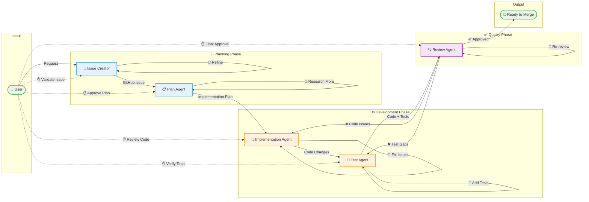

# Agent Pipeline Overview

## Pipeline Overview

This diagram shows **AI-Human collaboration** where agents assist but humans remain in control.

### Three Types of Flows

| Flow Type | Line Style | Description |
|-----------|------------|-------------|
| **Main Pipeline** | Solid arrows | Primary data flow between agents |
| **Human Checkpoints** | Dashed arrows (✋) | Human validates/approves at each step |
| **Iteration Loops** | Self-arrows (🔄) | Agent can refine its own output |

## Human-in-the-Loop Checkpoints

**Every step has human oversight:**

| Checkpoint | Human Action |
|------------|--------------|
| Issue Creator | Validate issue description, acceptance criteria |
| Plan Agent | Approve implementation approach before coding |
| Implementation Agent | Review code changes, request modifications |
| Test Agent | Verify test coverage and quality |
| Review Agent | Final approval before merge |

## Self-Iteration Loops

**Each agent can iterate on its own work:**

- **Issue Creator** 🔄 Refine issue based on feedback
- **Plan Agent** 🔄 Research more, gather additional context
- **Implementation Agent** 🔄 Fix linting issues, improve code
- **Test Agent** 🔄 Add more tests to reach coverage target
- **Review Agent** 🔄 Re-review after changes

## Feedback Loops

**Review Agent can request changes:**

- **❌ Code Issues** → Back to Implementation Agent
- **❌ Test Gaps** → Back to Test Agent

## Key Principles

### 1. AI Assists, Human Decides
Agents do the heavy lifting, but humans make final decisions at each checkpoint.

### 2. Not Everything Requires AI
- Simple issues? Human can write them directly
- Small changes? Skip the plan, implement directly
- Quick fix? Human can code without agents

### 3. Iterative Refinement
Each agent can refine its work multiple times before human approval.

### 4. Transparent Progress
Humans can observe and intervene at any point in the pipeline.

## When to Use Agents vs. Human Work

| Scenario | Recommended Approach |
|----------|---------------------|
| Complex feature with many files | Full agent pipeline |
| Simple bug fix | Human implements directly |
| Well-defined task | Plan + Implement agents |
| Exploratory work | Human + AI pair programming |
| Large refactoring | Agent for plan, human reviews carefully |

## Agent Pipeline Flow

| Stage | Agent | Input | Output | Human Checkpoint |
|-------|-------|-------|--------|------------------|
| 1 | **Issue Creator** | User request | GitHub Issue | ✋ Validate acceptance criteria |
| 2 | **Plan Agent** | GitHub Issue | Implementation Plan | ✋ Approve approach |
| 3 | **Implementation Agent** | Implementation Plan | Code changes | ✋ Review code |
| 4 | **Test Agent** | Plan + Code | Tests (≥80% coverage) | ✋ Verify coverage |
| 5 | **Review Agent** | Issue + Code + Tests | Approval/Feedback | ✋ Final sign-off |

