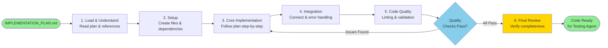

# Implementation Agent Workflow

## Workflow Steps

1. **Load & Understand** - Read implementation plan, study code examples and referenced files
2. **Setup** - Create new files, install dependencies, configure imports
3. **Core Implementation** - Execute plan steps systematically, mirror code patterns
4. **Integration** - Connect with existing code, implement error handling
5. **Code Quality** - Run linters, formatters, and project-specific checks
6. **Final Review** - Verify completeness, mark TODOs complete, prepare for testing

## Key Loop

If code quality checks fail, the agent loops back to core implementation to fix issues before proceeding to final review.

## Handoff

The agent outputs implemented code ready for the Testing Agent to validate with comprehensive test suites.
