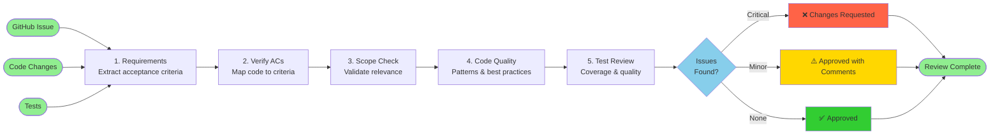

# Review Agent Workflow

## Workflow Steps

1. **Requirements** - Fetch GitHub issue, extract acceptance criteria and scope
2. **Verify ACs** - Map each acceptance criterion to implementation code
3. **Scope Check** - Ensure all changes are relevant, no scope creep
4. **Code Quality** - Review patterns, best practices, security, performance
5. **Test Review** - Verify coverage ≥80%, test quality, AC coverage

## Verdict Outcomes

- **✅ Approved** - Ready to merge, all criteria met
- **⚠️ Approved with Comments** - Can merge after addressing minor issues
- **❌ Changes Requested** - Must fix critical issues before merge

## Output

Structured review report with AC verification, code quality score, and prioritized issues.
